<!-- Animated Contribution Graph -->

<h3><code>ganesh@github ~ $ ./contributions.sh</code></h3>

  

<h3><code>ganesh@github ~ $ whoami</code></h3>

<b>Ganesh Kondekar</b> 
🎓 B.Tech IT Student (Final Year) 
💻 AI & Python Developer 
🤖 Building AI Agents & LLM Applications 
📍 Ahmedabad, India

  

<h3><code>ganesh@github ~ $ ./projects.sh</code></h3>

- 🚀 AI Blogger Pro
- 🛡️ AI Cyber Threat Intelligence System
- 🍔 FoodRush
- 📚 Library Management System

  

<h3><code>ganesh@github ~ $ ./tech-stack.sh</code></h3>

Python • C++ • SQL • Git • GitHub • Streamlit • LLMs • OpenRouter • HTML • CSS

  

<h3><code>ganesh@github ~ $ ./goals.sh</code></h3>

Preparing for GATE 2027 • Building Real-World AI Projects • Learning Multi-Agent AI Systems

